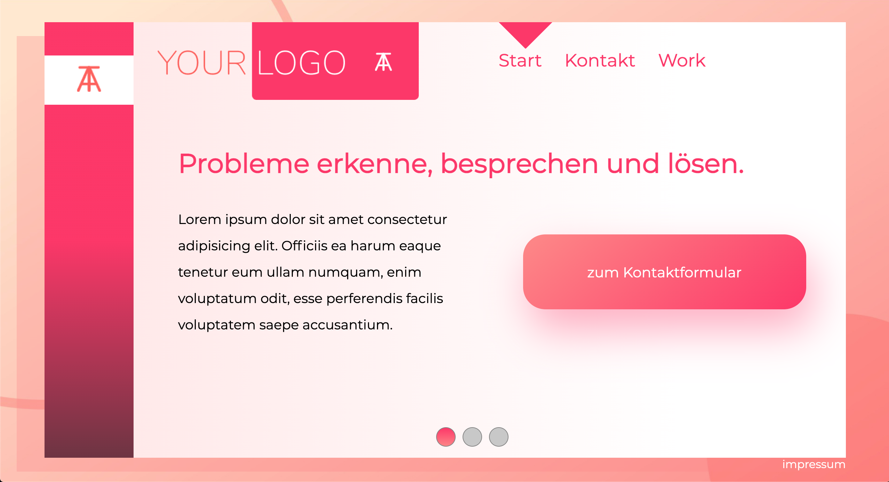
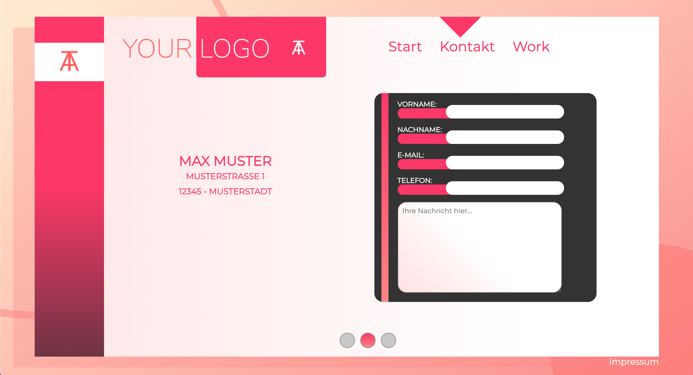
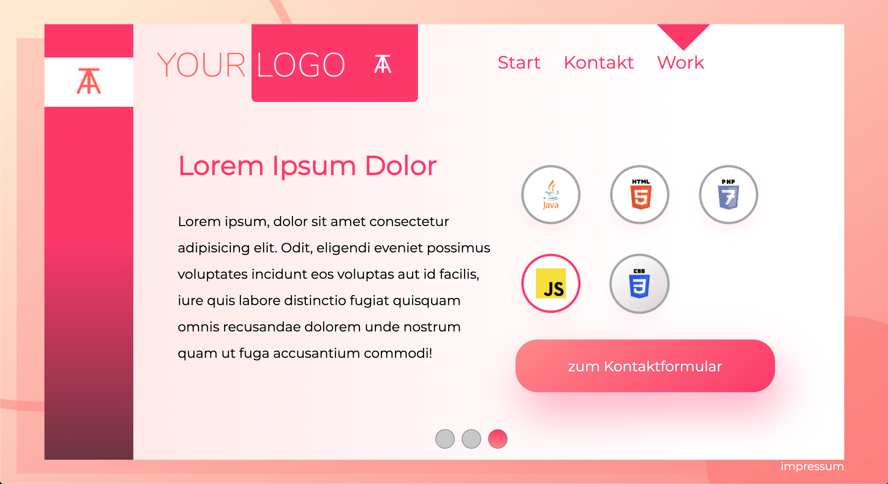
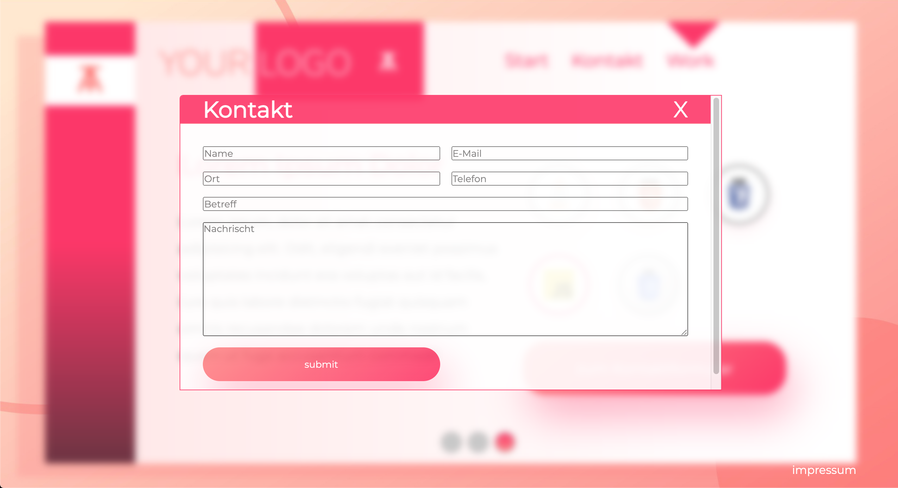
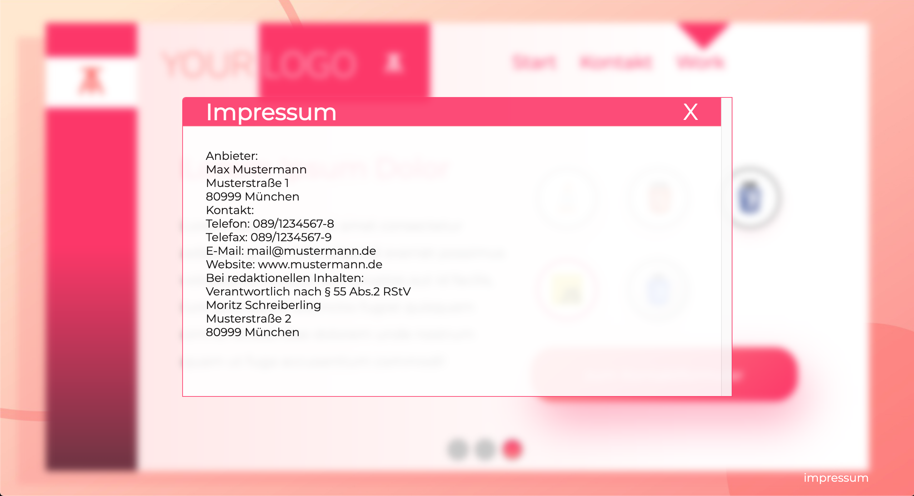

# Sample Webpage
I Made this webpage in the beginning of my internship. 
The code is written dynamically. DRY principle is implemented ;)

## Info
* It's made using pure code only. pure HTML & CSS and Vanilla JavaScript.
* Used Javascript to swich content of the page via links and buttons.
* Used Ajax to show up ipm.html and kontakt-form.html pages in a smooth way without refreshing the page.

## Used Colors

* brightRed: FF3366
* carmine: FF5F58
* dark: 333
* lightRed: FFE8CE
* grad: FF8484

## Screenshots

